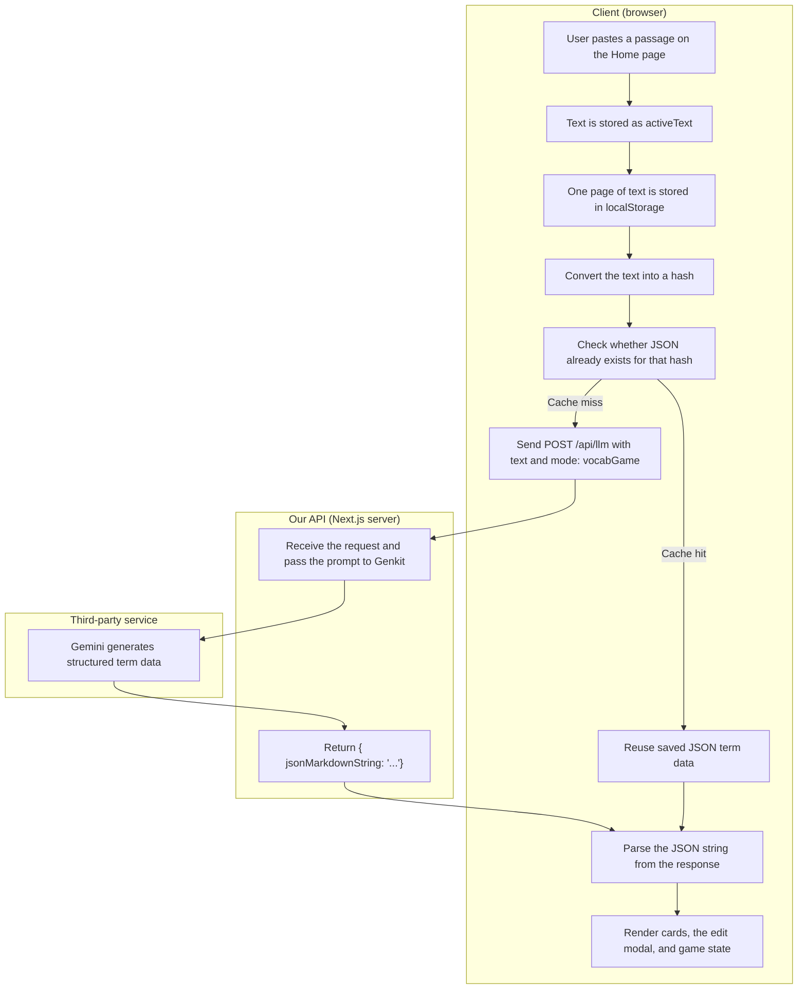
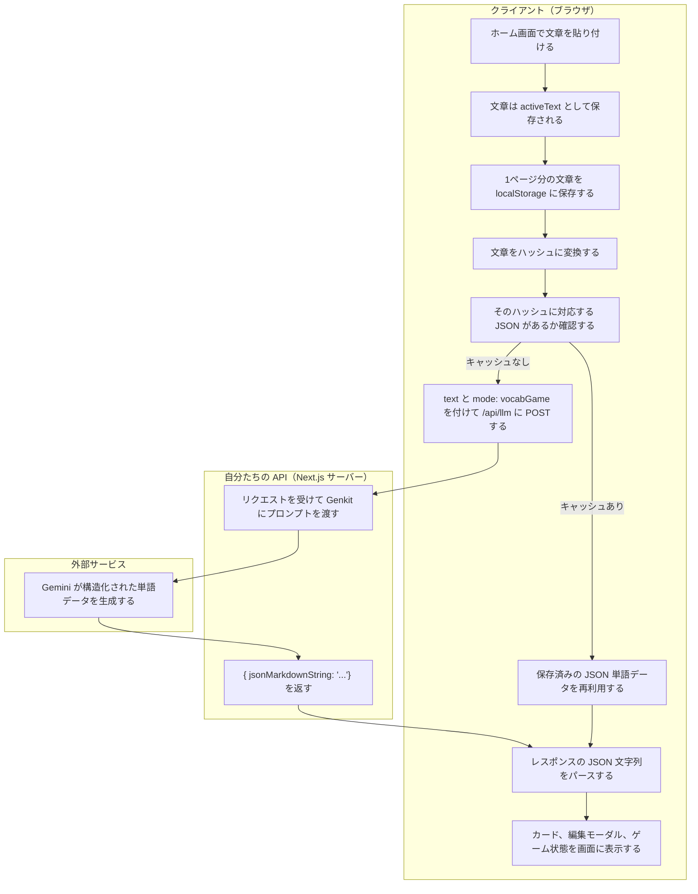

# Customer Presentation Plan

Use this as a short speaking guide while demoing the app.

## Demo Flow

1. Tool for studying Japanese.
2. Paste Japanese text here.
3. Press submit to split the text into pages (pagination).
4. Press the `gravity` button to play the game.
5. Words fall from the top of the screen.
6. Type the answer before the word hits the bottom.
7. If a word passes the red line, you must practice it.
8. If you get 2 wrong in a row, it is game over.
9. The terms fall faster and faster each time.

## Mermaid Diagram

## Japanese Speaker Lines

1. 日本語を勉強するときに使うツールです。
2. ここに日本語の文章を貼り付けます。
3. submit を押すと、文章がページごとに分割されます。
4. gravity ボタンを押すと、ゲームを始められます。
5. 単語は画面の上から落ちてきます。
6. 下まで落ちる前に、答えを入力します。
7. 赤い線を越えると、その単語を練習することになります。
8. 2回連続で間違えると、ゲームオーバーです。
9. 単語は、進むほど速く落ちてきます。

## Sample Passage

1. 毎朝、私は駅まで歩いて通勤します。
2. 途中で、小さな公園の横を通ります。
3. 近くのパン屋は、朝早くからいい香りがします。
4. 仕事の前に、コーヒーを一杯買うことが多いです。
5. 電車の中では、短い記事を読むようにしています。
6. 新しい単語が出てきたら、ノートに書き留めます。
7. 昼休みに、もう一度その単語を見直します。
8. 何度か見ると、意味が少しずつ覚えやすくなります。
9. 夕方には、文章全体の内容がだいぶ分かるようになります。
10. こうして、毎日の読書が少しずつ学習につながります。
