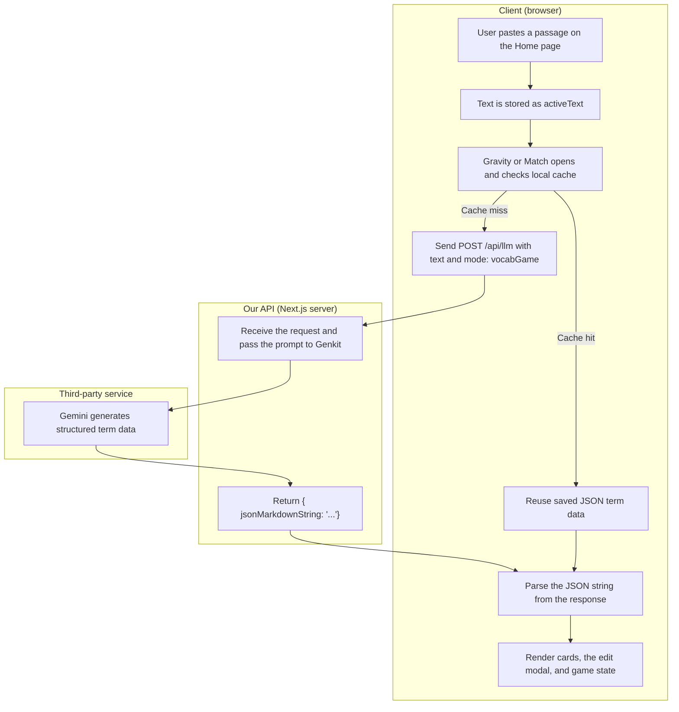
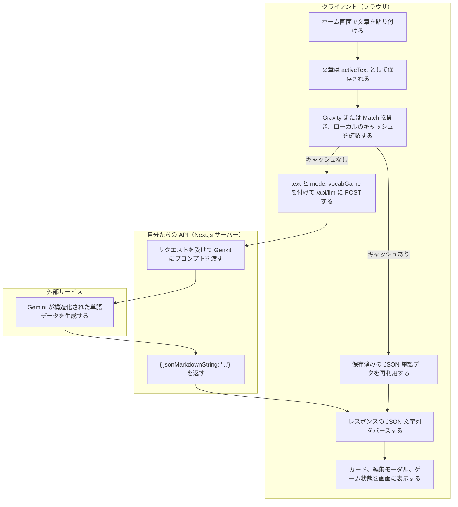

# Customer Presentation Plan

Use this as a short speaking guide while demoing the app.

## Demo Flow

1. Home page: paste a passage.
2. E-reader page: show the text split into reading chunks.
3. Gravity game: explain that AI returns structured JSON, and the game uses that JSON directly.
4. Edit Terms modal: open one term and explain that the detail fields are AI generated.
5. Long-term learning: explain SRS as a way to bring back words at the right time so they move into memory.

## Mermaid Diagram

## Japanese Speaker Lines

1. `ホーム画面に文章を貼り付けるだけで、AIが学習用の素材に変換します。`
2. `このe-readerでは、長い文章を読みやすいかたまりに分けて、学習しやすい形で表示します。`
3. `Gravityでは、AIが単なる文章ではなくJSON形式で単語データを返すので、アプリはそのまま各項目を使ってゲームを動かせます。`
4. `単語の意味、読み方、例などの詳細はすべてAIが生成しているので、あとから編集しながら品質を確認できます。`
5. `SRSは、忘れそうなタイミングで単語をもう一度出す仕組みで、短期記憶から長期記憶に移しやすくします。`

## Sample Passage

1. I opened the app and pasted a short article about daily routines.
2. The passage described a person waking up early and making breakfast.
3. It explained how the person walked to work instead of taking the bus.
4. Along the way, the person noticed a quiet park and a busy bakery.
5. The story mentioned a coworker who shared a useful language tip.
6. After lunch, the person reviewed a list of new words from the text.
7. Some of the words were easy to remember, but others needed more practice.
8. In the evening, the person read the same passage one more time.
9. This second review made the meanings feel more familiar.
10. By the end of the day, the passage was easier to understand and recall.
